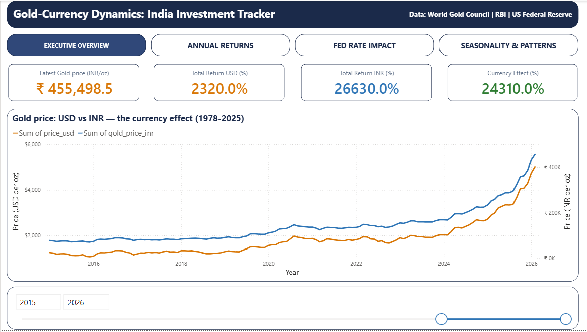
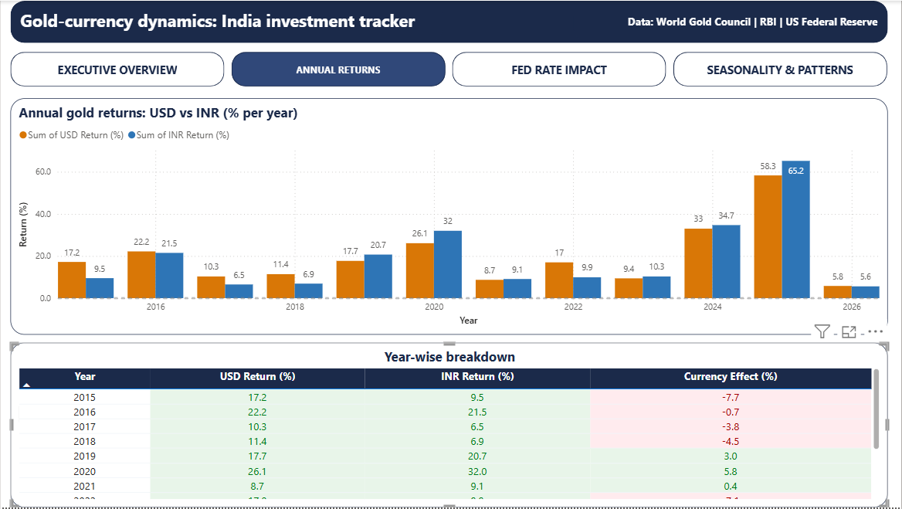
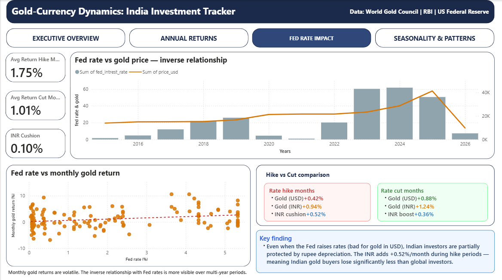
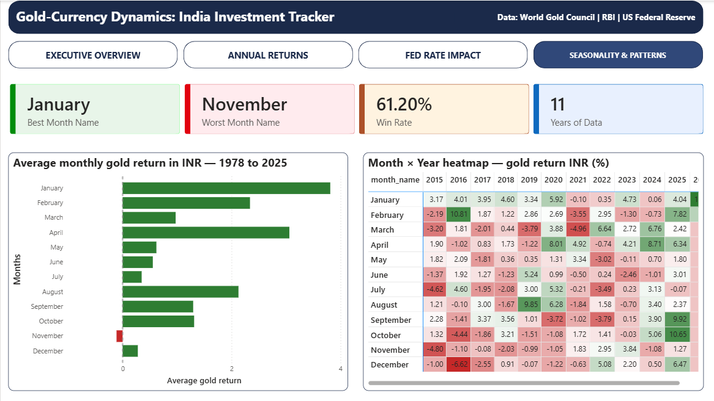

# Gold-Currency Dynamics: India Investment Tracker

> **Why does Indian gold outperform global gold by 10x?** — A data-driven deep dive into 47 years of gold prices, rupee depreciation, Fed policy, and inflation using Python, SQL, and Power BI.

---

## 📌 Problem Statement

Most gold investment analyses report returns in USD — which is dangerously incomplete for Indian investors.

An Indian buying gold in rupees is exposed to **two compounding forces simultaneously**:

1. The global gold price (denominated in USD)
2. The rupee's long-term depreciation against the dollar

Ignoring currency dynamics leads to **misguided investment decisions**. This project quantifies exactly how much of your gold return came from the metal itself — and how much came from the currency melting beneath it.

---

## 💡 Solution Overview

Built a full end-to-end analytical pipeline that:

- **Merged 4 independent economic datasets** spanning 47+ years into a single master table
- **Engineered derived metrics** — INR-adjusted gold prices, monthly returns, YoY inflation, currency effect per year
- **Ran 10 advanced SQL queries** covering annual returns, Fed rate impact, seasonality, inflation regimes, decade comparisons, and SIP simulation
- **Delivered a 4-page interactive Power BI dashboard** designed for both executive-level and deep-dive analysis

The key differentiator: **every insight is presented in both USD and INR**, making this directly actionable for Indian retail and institutional investors.

---

## 🛠 Tech Stack

| Layer               | Tool                                                         |
| ------------------- | ------------------------------------------------------------ |
| **Data Collection** | FRED API (Federal Reserve Economic Data), World Gold Council |
| **Data Cleaning**   | Python — `pandas`, `numpy`                                   |
| **Storage**         | CSV / Excel (raw + cleaned)                                  |
| **Analysis**        | PostgreSQL (10 analytical queries)                           |
| **Visualization**   | Power BI (4-page interactive dashboard)                      |

---

## 📊 Dataset Details

| Dataset               | Source             | Coverage            | Rows |
| --------------------- | ------------------ | ------------------- | ---- |
| Gold price (USD/oz)   | World Gold Council | Jan 1978 – Feb 2026 | 578  |
| USD/INR exchange rate | FRED — `EXINUS`    | Jan 1973 – Feb 2026 | 638  |
| US Federal Funds Rate | FRED — `FEDFUNDS`  | Jul 1954 – present  | 860  |
| US CPI Inflation      | FRED — `CPIAUCSL`  | Jan 1947 – present  | 950  |

**Master dataset:** 578 rows × 9 columns after joining all sources on month-period key.

---

## 📊 Key Features

### 1. Executive Overview — The Currency Effect

- KPI cards: latest gold price, total USD return, total INR return, currency amplification
- Dual-axis time series: Gold in USD vs Gold in INR (1978–2026)
- Interactive year-range slicer

### 2. Annual Returns — Year-by-Year Breakdown

- Grouped bar chart: USD return vs INR return per year (2015–2026)
- Conditional-formatted table: currency effect column highlights years where INR depreciation cost or boosted the investor

### 3. Fed Rate Impact Analysis

- Scatter plot: monthly Fed rate vs monthly gold return
- Key comparison card: **Rate Hike months vs Rate Cut months** — avg returns in both USD and INR
- Quantified the "INR cushion" — how much rupee depreciation offset Fed headwinds

### 4. Seasonality & Patterns

- Best/Worst month KPIs (January = best, November = worst)
- Bar chart: average monthly gold return in INR (1978–2025)
- Month × Year heatmap: complete return grid for individual year/month lookup

---

## 📈 Key Insights

| #   | Insight                                                        | Metric                  |
| --- | -------------------------------------------------------------- | ----------------------- |
| 1   | **Total USD return since 1978**                                | +2,320%                 |
| 2   | **Total INR return since 1978**                                | +26,630%                |
| 3   | **Currency amplification (pure rupee effect)**                 | +24,310%                |
| 4   | **During Fed rate hikes**, gold (INR) avg monthly return       | +0.94% vs +0.42% in USD |
| 5   | **INR cushion during hike months**                             | +0.52%/month            |
| 6   | **During Fed rate cuts**, INR adds                             | +0.36%/month over USD   |
| 7   | **Best month** for INR gold historically                       | January                 |
| 8   | **Worst month** for INR gold historically                      | November                |
| 9   | **Historical win rate** (months with positive INR gold return) | 61.2%                   |
| 10  | **Latest gold price (INR/oz)**                                 | ₹4,55,498.5             |

**The headline finding:** Indian gold investors earned **11.5x more** than global USD investors since 1978 — entirely because the rupee lost 91% of its value against the dollar. The currency isn't noise — it _is_ the return.

---

## 🧠 What I Learned

**Technical Skills Gained:**

- Multi-source time-series data joins using period-key alignment (handling non-standard month-end dates across datasets)
- Window functions: `ROW_NUMBER()`, `FIRST_VALUE()`, `LAG()`, `SUM() OVER()` for rolling and cumulative analytics
- Derived metric engineering: YoY inflation from CPI index, currency effect decomposition, SIP simulation in SQL
- Power BI dual-axis charts, conditional formatting, cross-page slicers, and KPI card design

---

## 🔧 Engineering Challenges & Solutions

> These are the real problems encountered — not textbook examples. Each one required judgment, not just syntax.

---

### Challenge 1 — Corrupt Raw Data in Gold Price CSV

| | Detail |
|---|---|
| **Problem** | The raw gold price CSV had 387 trailing empty rows (all `NaT` / `NaN`) and price values formatted as strings with commas — e.g. `"1,234.5"` — which caused `pd.to_numeric()` to silently produce `NaN` across the entire price column |
| **Solution** | Applied `str.replace(",", "")` before type conversion, used `pd.to_numeric(errors='coerce')` to catch remaining bad values, then `dropna()` to strip empty trailing rows — preserving all 578 valid records |
| **Skill** | Defensive data cleaning, type coercion, root cause vs symptom thinking |

---

### Challenge 2 — Date Alignment Across 4 Different Sources

| | Detail |
|---|---|
| **Problem** | Gold prices use month-**end** dates (`Jan 31`, `Feb 28`...) while all 3 FRED datasets use month-**start** dates (`Jan 1`, `Feb 1`...). A direct date-column join produced **zero matches** |
| **Solution** | Converted all date columns to `Period("M")` — a month-precision period key — before merging. This made `1978-01-31` and `1978-01-01` resolve to the same key `1978-01`, enabling a clean join |
| **Skill** | Time-series data engineering, period-based alignment, diagnosing silent join failures |

---

### Challenge 3 — Schema Inconsistency Across 4 Sources

| | Detail |
|---|---|
| **Problem** | Each dataset arrived with different column naming (`EXINUS`, `FEDFUNDS`, `CPIAUCSL`), different date string formats (`MM/DD/YYYY` vs `YYYY-MM-DD`), and different starting years (1947 to 1978) — making a blind merge unreliable |
| **Solution** | Standardized column names immediately after each read, converted all date fields to `datetime64[ns]`, and used `LEFT JOIN` on the gold master as the base — so the final dataset preserves gold's 1978 start date without losing FRED coverage |
| **Skill** | Multi-source schema normalization, join strategy, data contract enforcement |

---

### Challenge 4 — Inflation Rate Was Not in the Raw Data

| | Detail |
|---|---|
| **Problem** | FRED's CPI dataset provides an index value (e.g. `327.46`), not the inflation percentage. Raw data also had one null at Oct 2025, which would corrupt the YoY calculation if not handled first |
| **Solution** | Forward-filled the single null (`ffill()`), then applied `pct_change(periods=12) * 100` to compute year-over-year inflation — the standard economic method for deriving inflation from a price index |
| **Skill** | Economic domain knowledge, feature engineering from index data, order-of-operations in data prep |

---

### Challenge 5 — Isolating Currency Effect from Gold Returns in SQL

| | Detail |
|---|---|
| **Problem** | Proving the "currency effect" required knowing each year's opening and closing price in both USD and INR — but the data is row-per-month, not row-per-year. Standard `GROUP BY` would lose the first/last row distinction |
| **Solution** | Used `ROW_NUMBER() OVER(PARTITION BY year ORDER BY date ASC/DESC)` inside a CTE to tag the first and last row per year, pivoted with `MAX(CASE WHEN ...)`, then computed `INR return − USD return = pure currency effect` |
| **Skill** | Advanced window functions, CTE chaining, business logic decomposition in SQL |

---

### Challenge 6 — SIP Investment Simulation in Pure SQL

| | Detail |
|---|---|
| **Problem** | Simulating a ₹1,000/month gold SIP over 578 months required tracking cumulative units purchased month-by-month, then computing current portfolio value against total invested — a running-total problem with no procedural loop |
| **Solution** | Used `SUM(1000 / gold_price_inr) OVER(ORDER BY date)` for running cumulative units, paired with `SUM(1000) OVER(ORDER BY date)` for total invested — then multiplied running units by current price for live portfolio value |
| **Skill** | Financial modeling in SQL, running aggregates, translating investment concepts to window logic |

---

### Challenge 7 — Preventing Duplicate Rows on Fed Rate Join

| | Detail |
|---|---|
| **Problem** | Fed rate data occasionally had multiple entries per month. Joining it directly to the master table would silently fan out rows — inflating the dataset without any error |
| **Solution** | Applied `drop_duplicates(subset="month_key", keep="last")` before the join, ensuring exactly one Fed rate value per month. Verified row count matched the base master after each join |
| **Skill** | Join integrity awareness, deduplication strategy, defensive data pipeline design |

---

## 📷 Dashboard Preview

### Page 1 — Executive Overview



### Page 2 — Annual Returns: USD vs INR



### Page 3 — Fed Rate Impact



### Page 4 — Seasonality & Patterns



---

## ⚙️ How to Run the Project

### Prerequisites

- Python 3.9+
- PostgreSQL 14+
- Power BI Desktop (free)

### Step 1 — Clone the Repository

```bash
git clone https://github.com/your-username/gold-currency-dynamics.git
cd gold-currency-dynamics
```

### Step 2 — Install Python Dependencies

```bash
pip install pandas numpy openpyxl
```

### Step 3 — Run the Data Cleaning Notebook

```bash
jupyter notebook notebooks/data_cleaning.ipynb
```

This produces all cleaned CSVs in `data/cleaned/`.

### Step 4 — Load into PostgreSQL

```sql
-- Run in order:
-- 1. Create table
\i sql/01.CREATE_TABLE.sql

-- 2. Import data
COPY gold_master FROM '/path/to/data/cleaned/gold_investment_master.csv'
  WITH (FORMAT csv, HEADER true);

-- 3. Add helper columns
\i sql/01.DATA_VERIFICATION_HELPER_CLMS.sql

-- 4. Run analysis
\i sql/03.DATA_ANALYSIS.sql
```

### Step 5 — Open the Power BI Dashboard

Open `dashboards/gold_currency_dashboard.pbix` in Power BI Desktop.
Update the data source path to point to your local `gold_investment_master.csv`.

---

## 🔗 Links

- **GitHub Repo:** https://github.com/Shivurh04/gold-currency-dynamics

---

## ⭐ Why This Project Stands Out

1. **Real-world economic complexity** — This isn't a classroom dataset. It integrates macroeconomic indicators (Fed rate, CPI, FX) with asset price data, the exact combination analysts work with in investment firms and financial research.

2. **End-to-end ownership** — Every stage was built from scratch: raw data ingestion, cleaning, SQL modeling, and BI visualization. No pre-cleaned Kaggle datasets. No pre-built dashboards.

3. **Insight depth beyond the obvious** — The project doesn't stop at "gold went up." It quantifies _why_ Indian gold outperforms, isolates the Fed rate paradox for INR investors, and runs a 47-year SIP simulation.

4. **Production-quality SQL** — 10 analytical queries using advanced window functions (`LAG`, `FIRST_VALUE`, rolling averages), CTEs, conditional aggregation, and UNION — the kind of SQL written in actual data analyst and data engineering roles.

5. **Dashboard storytelling** — The 4-page Power BI report is structured as a narrative: overview → annual breakdown → macro impact → patterns. Each page answers a specific business question, not just displays numbers.

---

_Dataset coverage: January 1978 – February 2026 | 578 monthly observations | Sources: World Gold Council, RBI, US Federal Reserve (FRED)_
